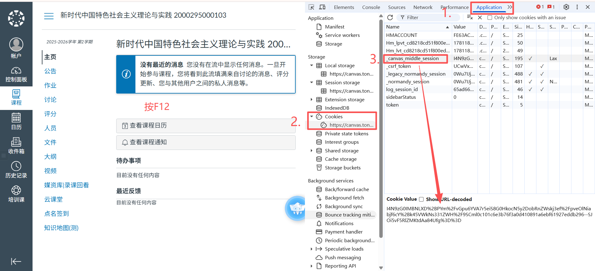
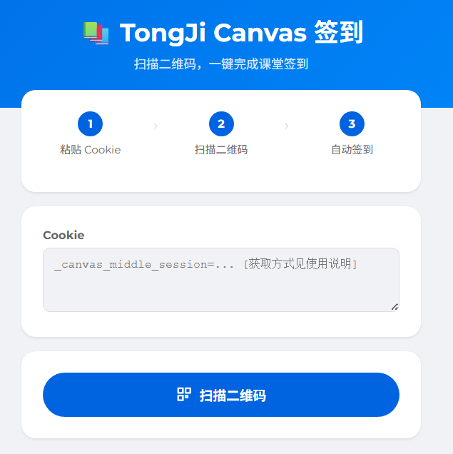
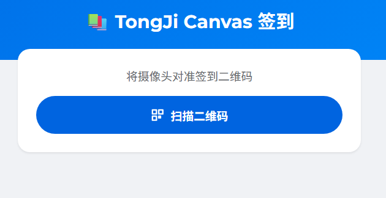
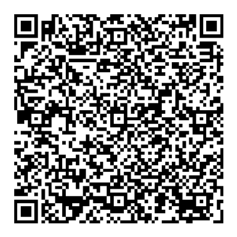

# TongJi_Canvas_Web 

Web版同济大学Canvas系统课堂签到助手 

多多宣传，点点star~ 

[在线版访问：https://handsome.eu.org/canvas/index.html](https://handsome.eu.org/canvas/index.html)

推荐构造专属 URL，可永久使用，转发给他人打开即可直接扫码签到。

## 使用说明
两步搞定：拿到 Cookie → 粘贴签到

### 步骤 1：获取你的 Cookie
1. 打开[同济 Canvas](https://canvas.tongji.edu.cn) 并完成登录，进入**任意课程页面**。
2. 按下 `F12` 打开开发者工具 → 切换到 `Application` 标签页 → 左侧导航栏找到 `Cookies` → 定位到 `_canvas_middle_session` → **复制完整的值**。
若找不到该字段，先进入“点名签到”选项卡，再按 `F12`（可多刷新几次）。



### 步骤 2：粘贴并签到
#### 方式一：手动粘贴
回到签到工具页面，将复制的 Cookie 粘贴到输入框，点击签到按钮即可。



#### 方式二（推荐）：URL 免输入
将 Cookie 拼接至以下 URL 中，后续打开该 URL 可直接跳过输入步骤，仅需扫码签到：
```
https://handsome.eu.org/canvas/index.html?_canvas_middle_session=你的Cookie
```



> 💡 提示：推荐每个人构造专属 URL，可永久使用且不会过期，转发给他人打开即可直接扫码。

## 功能测试
扫描下方测试二维码，验证工具是否正常工作：



扫码后工具会自动签到，正常应显示签到页：未加入此课程：
- 🟢 **签到成功** — 工具正常可用
- 🔵 **已签过到** — 你已完成本次签到
- 🔴 **签到失败** — 若跳转至登录页，说明 Cookie 无效

> 💡 提示：手机可通过双指缩放放大二维码，扫码时保持二维码居中、光线充足，可实现秒扫。

## 常见问题
### 📷 相机打不开？
推荐使用 `Safari` 或 `Chrome` 浏览器打开工具，检查以下项：
1. 浏览器已获取摄像头权限；
2. 浏览器弹出权限请求时选择“允许”；
3. 摄像头未被其他应用占用；
4. 允许浏览器弹出窗口（扫码功能在弹窗中运行）。

### 🚫 扫不到二维码？
1. 让二维码占画面的 `1/3 ~ 1/2`，避免画面占比过小；
2. 保证扫码环境光线充足，避免二维码反光；
3. 手机双指放大二维码（光学变焦不会导致模糊）。

### ❌ 签到失败？
最常见原因：**签到超时**（教室网络不稳定/人数较多），建议多次尝试。

### 🍪 Cookie 怎么拿？
参考「步骤 1」操作：Canvas 保持登录状态 → F12 → Application → Cookies → 复制 `_canvas_middle_session` 的值。

## 注意事项
1. 本项目也提供安卓版 APK，使用体验更佳；
2. ⚠️ 免责声明：仅供学习交流使用，请遵守学校相关规定，使用后果自负；
3. ⭐ 开源支持：欢迎提交 Issue / PR，期待你的 Star 支持！

### 相关链接
- 🤖 安卓版：[github.com/mmmlllnnn/TongJi_Canvas](https://github.com/mmmlllnnn/TongJi_Canvas)（特别好用，强烈推荐）
- 🌐 Web 版：[github.com/mmmlllnnn/TongJi_Canvas_Web](https://github.com/mmmlllnnn/TongJi_Canvas_Web)（轻量化，省心）

---


源码部署在服务器上 需要php环境